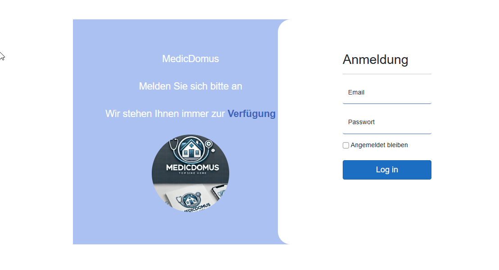
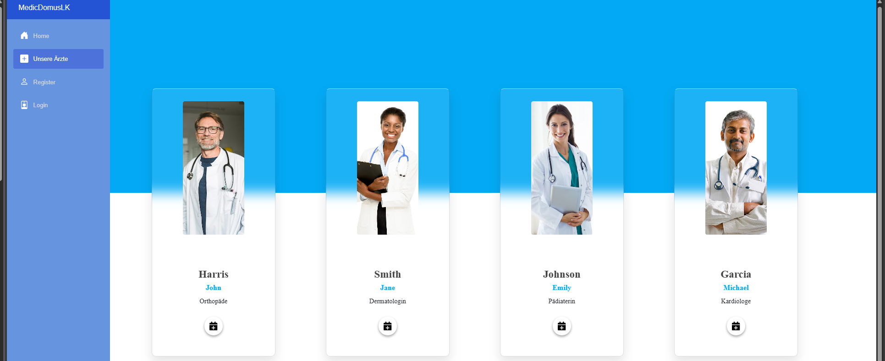
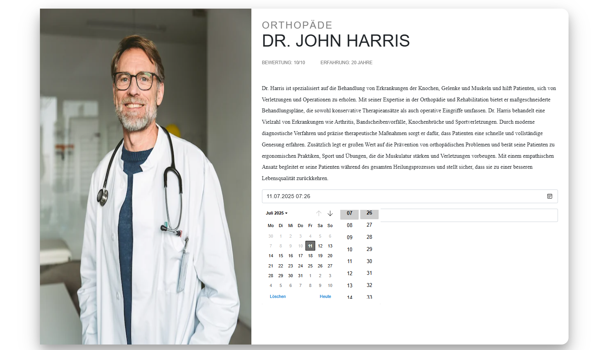
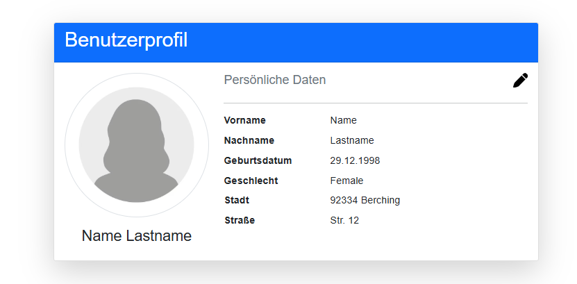
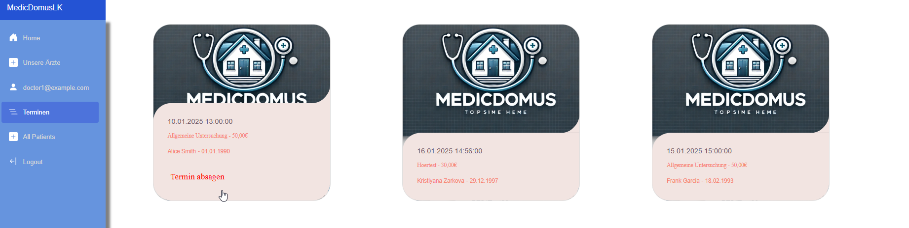
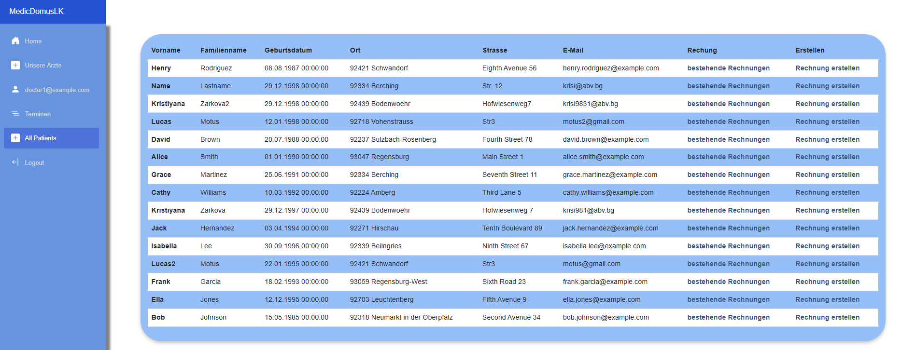
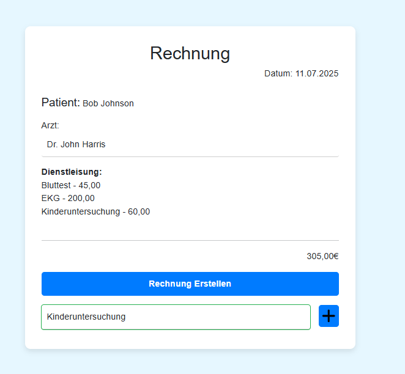
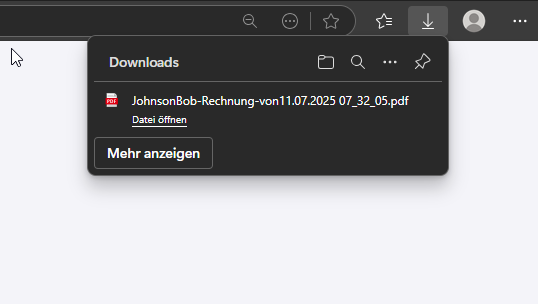
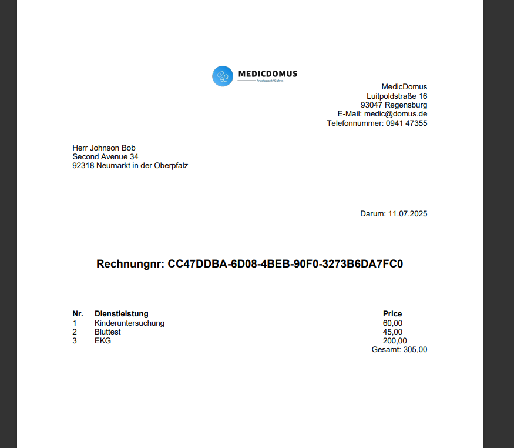

# MedicDomusLK

**MedicDomusLK** is a web application that enables **patients** to manage medical appointments and billing, while providing **doctors** with tools to organize their services and patients.

---

## 🧑‍⚕️ What Is MedicDomusLK?

This platform allows:

### For Patients:
- Create a personal profile
- Book appointments with various doctors across different services
- Cancel scheduled appointments
- View and download medical bills as PDFs

### For Doctors:
- Create and manage their profile (including specialty, experience, photo, etc.)
- See upcoming appointments
- Cancel appointments
- Create and send bills to patients
- Track payment status
- 

---

## 🏥 Core Features

- Role-based user system (Doctor / Patient)
- Dynamic service offerings (e.g., Blood Tests, Ultrasound, Vaccinations, etc.)
- Full appointment lifecycle: creation, cancellation, and tracking
- Invoice generation by doctors
- PDF export of bills for patients
- Pre-seeded towns and medical services for realistic setup

---

## 🗃️ Tech Stack

- ASP.NET Core (Razor Pages / Blazor)
- Entity Framework Core
- ASP.NET Identity (User and Role management)
- SQL Server
- C#

---

## 📄 Sample Doctor Logins

You can log into one of the pre-seeded doctor profiles:

- **doctor1@example.com**  
- **doctor2@example.com**  
- **doctor3@example.com**  
- **doctor4@example.com**  

All use the same password:

- Password123!
